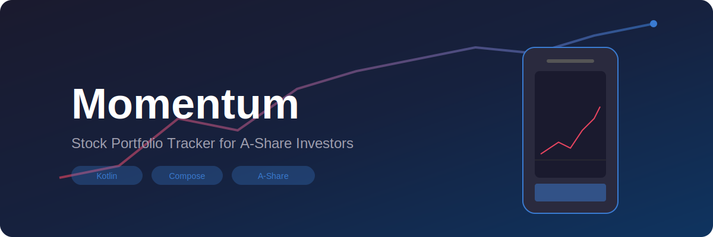

<p align="center">
  
</p>

<h1 align="center">Momentum — 股票投资追踪助手</h1>

<p align="center">
  <a href="#核心功能">核心功能</a> •
  <a href="#截图">截图</a> •
  <a href="#技术栈">技术栈</a> •
  <a href="#架构">架构</a> •
  <a href="#快速开始">快速开始</a> •
  <a href="#常见问题">常见问题</a>
</p>

<p align="center">
  <a href="README.md">English</a> | <b>中文</b>
</p>

<p align="center">
  <b>Momentum</b>（原 Scanfolio）是一款开源的 Android App，帮助中国 A 股投资者追踪、分析并优化自己的股票交易。输入股票代码即可自动从免费 API 获取实时行情，计算技术指标，按战法分组管理，并可视化盈亏曲线。
</p>

<hr>

## 核心功能

### 🔍 股票搜索 & 自动数据填充
输入 6 位股票代码即可搜索。Momentum 自动从 **东方财富** 和 **新浪财经** 的免费 API 获取实时行情、K 线、资金流向，并填充 20+ 数据列：
- 最新价、涨跌幅、成交量、换手率、振幅
- 市盈率、市净率、总市值、流通市值
- 所属行业、概念标签
- 20 日涨幅、月涨跌幅、连续上涨天数、涨停次数

### 📊 技术指标（自动计算）
基于 60 天日 K 线数据自动计算：
- **KDJ**（9 日随机指标）
- **MACD**（12/26/9 指数平滑移动平均）
- **RSI**（6/12/24 相对强弱指标）
- **BOLL**（20 日布林带）

指标直接进入自选股数据列，可用于对比分析。

### 📈 盈亏追踪 & 收益曲线
记录每笔交易的买入/卖出价格、数量、获利比例、战法名称。Momentum 自动生成：
- **已实现盈亏**（已平仓交易）
- **未实现盈亏**（持仓浮盈，基于 API 实时价）
- **胜率、平均盈利/亏损、最大盈利/亏损** 统计
- **月度盈亏柱状图** 和 **累积收益曲线**（MPAndroidChart）

### 📂 自选股分组管理
按战法策略分组管理自选股（如"突破低吸"、"首板打板"、"趋势跟踪"）。每组独立显示胜率和总盈亏。可折叠的分组标题让持仓列表更清晰。

### 📐 成功/失败对比分析
将盈利交易和亏损交易的数据列进行对比：
- 哪些数据特征与成功相关？（如"盈利组平均涨跌幅 +3.5%，亏损组平均 -1.2%"）
- 大盘对比：你的股票有多少次跑赢/跑输上证指数？
- 支持实盘/模拟盘筛选

### 🖼️ 截图导入（OCR）
通过相机或相册导入同花顺持仓截图。Momentum 使用 OCR 识别表格数据，按股票代码去重合并，快速建立持仓。

### 🔧 完全自定义
- 开关数据列显示
- 自定义战法策略
- 添加大盘指数进行对比
- JSON 导入/导出所有数据

---

## 截图

| 持仓页 | 搜索添加 | 股票详情 | 盈亏详情 |
|--------|---------|---------|---------|
|  |  |  |  |

| 分析页面 | 分组展示 | 设置页 | OCR 导入 |
|----------|---------|--------|---------|
|  |  |  |  |

> **注意：** 截图目前为占位符。欢迎提交 PR 添加真实截图！

---

## 技术栈

| 层级 | 技术 |
|------|------|
| **语言** | 纯 Kotlin |
| **UI** | Jetpack Compose + Material 3 |
| **导航** | Navigation Compose（单 Activity） |
| **架构** | 整洁架构（Repository 模式 + ViewModel） |
| **数据库** | Room + KSP，Flow 响应式查询 |
| **网络请求** | OkHttp 4.x（东方财富 & 新浪财经 API）|
| **图表** | MPAndroidChart v3.1.0 |
| **序列化** | Gson |
| **测试** | JUnit 4 + MockK + kotlinx-coroutines-test |
| **最低/目标 SDK** | 26 / 35 |

### 使用的免费 API

| 接口 | 用途 | 地址 |
|------|------|------|
| **新浪财经** | 基础实时行情 | `hq.sinajs.cn/list=` |
| **东方财富** | 完整行情（PE、PB、市值、行业） | `push2.eastmoney.com/api/qt/stock/get` |
| **东方财富** | 日 K 线（60 天） | `push2.eastmoney.com/api/qt/stock/kline/get` |
| **东方财富** | 资金流向（主力/散户） | `push2.eastmoney.com/api/qt/stock/fflow/daykline/get` |

所有接口均为 **免费、公开、无需注册**。

---

## 架构

```
┌─────────────────────────────────────────────────────┐
│                     UI 层                            │
│  Compose 界面 ←→ ViewModels (StateFlow)              │
│  持仓 · 详情 · 盈亏 · 分析 · 设置                   │
└───────────────────┬─────────────────────────────────┘
                    │ 收集 StateFlow
┌───────────────────▼─────────────────────────────────┐
│                    Repository 层                     │
│  StockRepository · TradeRepository · SettingsRepo   │
│  MarketIndexRepository                              │
└───────┬───────────────────────────────┬─────────────┘
        │                               │
┌───────▼──────────┐          ┌─────────▼───────────┐
│   Room 数据库     │          │  StockApiClient     │
│ 6 个 Entity/DAO  │          │  OkHttp + 东方财富  │
│  + TypeConverter │          │  + 新浪财经         │
└───────────────────┘          └─────────────────────┘

  TechnicalIndicatorCalculator (KDJ · MACD · RSI · BOLL)
```

### 关键设计决策

- **单 Activity 架构**：一个 `MainActivity` + Compose Navigation 处理所有路由。底部三个标签（持仓 / 添加 / 分析）+ 子页面路由。
- **Repository 驱动数据访问**：ViewModel 不直接访问 DAO 或 OkHttp。Repository 层抽象数据源并返回 `Flow<T>` 实现响应式更新。
- **StockApiClient 作为外观类**：所有外部 API 调用（新浪行情、东方财富完整行情、K 线、资金流向）集中在一个类中。`buildDataColumns()` 将原始 API 数据转换为数据库使用的 `Map<String,String>` 格式。
- **离线可用**：股票数据获取后持久化到 Room。离线时可查看缓存数据，仅实时行情需要网络。

---

## 快速开始

### 环境要求
- Android Studio Hedgehog (2023.1.1+) 或更新版本
- JDK 17
- Android 设备或模拟器，API 26+

### 克隆 & 构建

```bash
git clone https://github.com/yourusername/momentum.git
cd momentum
./gradlew assembleDebug
```

APK 生成路径：`app/build/outputs/apk/debug/app-debug.apk`

### 运行测试

```bash
./gradlew testDebugUnitTest
```

测试覆盖：
- `StockApiClientTest` — 交易所判断、新浪行情解析、K 线解析、数据列构建
- `TechnicalIndicatorCalculatorTest` — KDJ、MACD、RSI、BOLL 计算和输出格式化

---

## 常见问题

**问：需要 API Key 吗？**  
不需要。所有行情数据来自新浪财经和东方财富的免费公开接口，无需注册。

**问：支持港股和美股吗？**  
目前仅支持 A 股（上海、深圳、北京交易所，代码以 0/3/4/6/8 开头）。暂无港股/美股支持计划。

**问：可以离线使用吗？**  
部分功能可以。已获取的股票数据和交易记录持久化在 Room 数据库中。实时行情、K 线、资金流向需要网络。

**问：数据安全吗？**  
所有数据仅保存在本地设备。无账户系统、无云同步、无埋点。唯一的网络请求是向公开股票 API 获取行情数据。

---

## 路线图

- [x] 股票代码搜索 + API 自动填充
- [x] 技术指标（KDJ、MACD、RSI、BOLL）
- [x] 盈亏追踪 + 收益曲线图表
- [x] 自选股按战法分组
- [x] 成功/失败对比分析 + 大盘对比
- [x] 截图 OCR 导入
- [ ] 深色模式优化
- [ ] 桌面 Widget（持仓概览）
- [ ] 目标价通知提醒
- [ ] 导出 Excel/CSV

---

## 参与贡献

欢迎参与贡献！步骤如下：

1. **Fork** 本仓库
2. **创建功能分支**：`git checkout -b feat/amazing-feature`
3. **提交修改**：`git commit -m "feat: add amazing feature"`
4. **推送**：`git push origin feat/amazing-feature`
5. **创建 Pull Request**

请确保：
- 测试通过（`./gradlew testDebugUnitTest`）
- 构建成功（`./gradlew assembleDebug`）
- 代码风格与现有项目保持一致（Kotlin、Compose、Material 3）
- Commit message 遵循 [Conventional Commits](https://www.conventionalcommits.org/)

### 开发环境

在 Android Studio 中打开项目，同步 Gradle，即可在模拟器或真机上运行。所有股票 API 无需任何配置即可使用。

---

## License

```
MIT License

Copyright (c) 2026 Momentum

Permission is hereby granted, free of charge, to any person obtaining a copy
of this software and associated documentation files (the "Software"), to deal
in the Software without restriction, including without limitation the rights
to use, copy, modify, merge, publish, distribute, sublicense, and/or sell
copies of the Software, and to permit persons to whom the Software is
furnished to do so, subject to the following conditions:

The above copyright notice and this permission notice shall be included in all
copies or substantial portions of the Software.

THE SOFTWARE IS PROVIDED "AS IS", WITHOUT WARRANTY OF ANY KIND, EXPRESS OR
IMPLIED, INCLUDING BUT NOT LIMITED TO THE WARRANTIES OF MERCHANTABILITY,
FITNESS FOR A PARTICULAR PURPOSE AND NONINFRINGEMENT. IN NO EVENT SHALL THE
AUTHORS OR COPYRIGHT HOLDERS BE LIABLE FOR ANY CLAIM, DAMAGES OR OTHER
LIABILITY, WHETHER IN AN ACTION OF CONTRACT, TORT OR OTHERWISE, ARISING FROM,
OUT OF OR IN CONNECTION WITH THE SOFTWARE OR THE USE OR OTHER DEALINGS IN THE
SOFTWARE.
```
